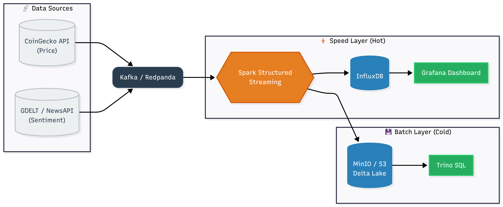

# ⚡ Real-Time Intelligence: Crypto-Market \& Media Analysis


-2C3E50?style=for-the-badge\&logo=apachekafka)


> **A scalable Big Data pipeline leveraging Lambda Architecture to quantify the immediate impact of global media sentiment on Bitcoin volatility.**


---


## 📖 Project Overview


This project focuses on the **correlation between media sentiment and crypto-market volatility**. In a market driven by "FOMO" and "FUD", traditional indicators are often lagging. This system ingests financial data and global news in real-time to answer the question: *Can media sentiment predict immediate price corrections?*


### Key Features
* **Real-Time Ingestion:** Fetches live Bitcoin prices (CoinGecko) and breaking news (GDELT/NewsAPI).
* **Sentiment Analysis:** Computes polarity scores (-1 to +1) for news headlines on the fly using `TextBlob`.
* **Lambda Architecture:**
    * **Speed Layer (Hot Path):** Real-time dashboarding via InfluxDB & Grafana.
    * **Batch Layer (Cold Path):** Historical archiving in Delta Lake format (MinIO/S3).
* **Event Detection:** Automatically flags "Breaking News" moments based on volume anomalies.
* **Technical Indicators:** Generates OHLC candlesticks using Spark Windowing.


---


## 🏗️ Architecture


The project is built on a containerized **Lambda Architecture**:





1.  **Ingestion:** Python Producer $\rightarrow$ **Redpanda (Kafka)**.

2.  **Processing:** **Apache Spark Structured Streaming** (PySpark).

3.  **Storage:**
- *Hot Path:* **InfluxDB** (Time Series).
- *Cold Path:* **MinIO** (S3 Object Storage) with **Delta Lake**.

4.  **Visualization:** **Grafana** (Dashboards) & **Trino** (SQL Queries).

---


## 🛠️ Tech Stack

- **Language:** Python 3.9 (PySpark, TextBlob, Kafka-Python).
- **Streaming:** Redpanda (Kafka compatible, C++).
- **Engine:** Apache Spark 3.5.0.
- **Storage:** InfluxDB, MinIO (S3), Delta Lake.
- **Visualization:** Grafana.
- **Infrastructure:** Docker & Docker Compose.


---


## 🚀 Getting Started

Prerequisites
- Docker Desktop installed and running.
- Python 3.x installed locally.
- Java 8 or 11 (Required for Spark).
### Installation

1. Clone the repository

```Bash

git clone https://github.com/wijdanelbakhouchi/Projet_BigData.git

cd Projet_BigData

```

2. Install Python Dependencies

```Bash

pip install kafka-python textblob pyspark requests delta-spark

```

3. Start the Infrastructure Launch the containers (Redpanda, InfluxDB, Grafana, MinIO) in the background:

```Bash

docker-compose up -d

```

4. Verify Services

- Grafana: http://localhost:3000 (User: admin / Password: admin)

- MinIO Console: http://localhost:9001 (User: minio / Password: minio123)


## 💻 Usage

1. Start the Producer

This script fetches data from APIs and pushes it to the Kafka topic crypto-topic.

```Bash

python producer.py

```

2. Start the Spark Processor

This script consumes the Kafka stream, calculates sentiment/OHLC, and writes to both InfluxDB and MinIO.

```Bash

python spark_processor.py

```

**Note:** Ensure you have winutils.exe configured if running natively on Windows, or submit this job to a Spark container.

3. Visualize (Real-Time)

Go to Grafana (http://localhost:3000).
- Import the dashboard JSON file.
- You will see the live Bitcoin price vs. Sentiment correlation and volatility candles.

4. Verify Batch Storage

To prove the "Cold Path" (Batch Layer) is working, run the verification script. This reads the Delta tables stored in MinIO.

```Bash

python verify_batch.py

```

**Output:** Displays a table of historical data retrieved from the Data Lake.

## 📊 Results & Screenshots

**Real-Time Correlation**
Green Line: BTC Price | Yellow Line: Media Sentiment
    Observation: Sharp drops in sentiment often precede price corrections.

**Event Detection & Volatility**

Bars indicate news volume per minute.

**Batch Layer Validation**

Querying the Data Lake (MinIO) to verify historical storage.

## 📂 Project Structure

```Bash


├── trino/                   # Trino configuration (Catalog)

├── architecture.png         # Architecture Diagram

├── docker-compose.yml       # Infrastructure definition (Redpanda, Influx, MinIO, Grafana)

├── producer.py              # Data ingestion \& Sentiment Analysis (TextBlob)

├── spark_processor.py       # Spark Structured Streaming logic \& Dual-Write

├── verify_batch.py          # Script to query MinIO/Delta Lake

└── README.md                # Project documentation

```

## 👥 Authors

- Wijdane ELBAKHOUCHI

- Amine BENZRIOUAL

- Salma FELLAQ

- Salma EL KHIDER

- **Supervisor:** Pr. HADDADI Amine

## 📜 License

This project is released for educational and academic purposes.

It is open-source and free to use, modify, and distribute for learning and demonstration.

**Disclaimer:** This software is provided "as-is" without any warranty. It was developed as a proof-of-concept for the Big Data module at the Faculty of Sciences, Rabat, and is not intended for production use in financial trading.
